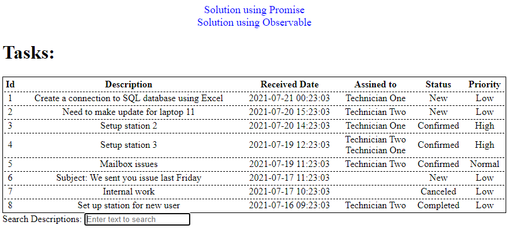

# TaskFS

This project was generated with [Angular CLI](https://github.com/angular/angular-cli) version 12.2.18.

## Instalation

Run `npm install` to download required packages.

## Development server

Run `ng serve` for a dev server. Navigate to `http://localhost:4200/`.

## Usage

Navigate to `http://localhost:4200/` to see welcome screen with links to to solutions.
Navigate to `http://localhost:4200/promise` or click corresponding link to see table with tasks downloaded from API/JSON as promise.
Navigate to `http://localhost:4200/observable` or click corresponding link to see table with tasks downloaded from API/JSON as observable.

Type text in search box to show only entries that contain this text in their description.

## Info

`src\assets\response.json` - JSON mockup data used in this application.
`src\app\components\display-tasks\` - folder with component that uses Promise to display data.
`src\app\components\display-tasks-observable\` - folder with component that uses Observable to display data.
`src\app\interfaces\tasks.ts` - Interface for tasks ftched from API/JSON.
`src\app\pipes\filter-text.pipe.ts` - Pipe that filters displayed data to match search phrase with description.
`src\app\services\fetch-tasks.service.ts` - Service that reads data from API/JSON.
